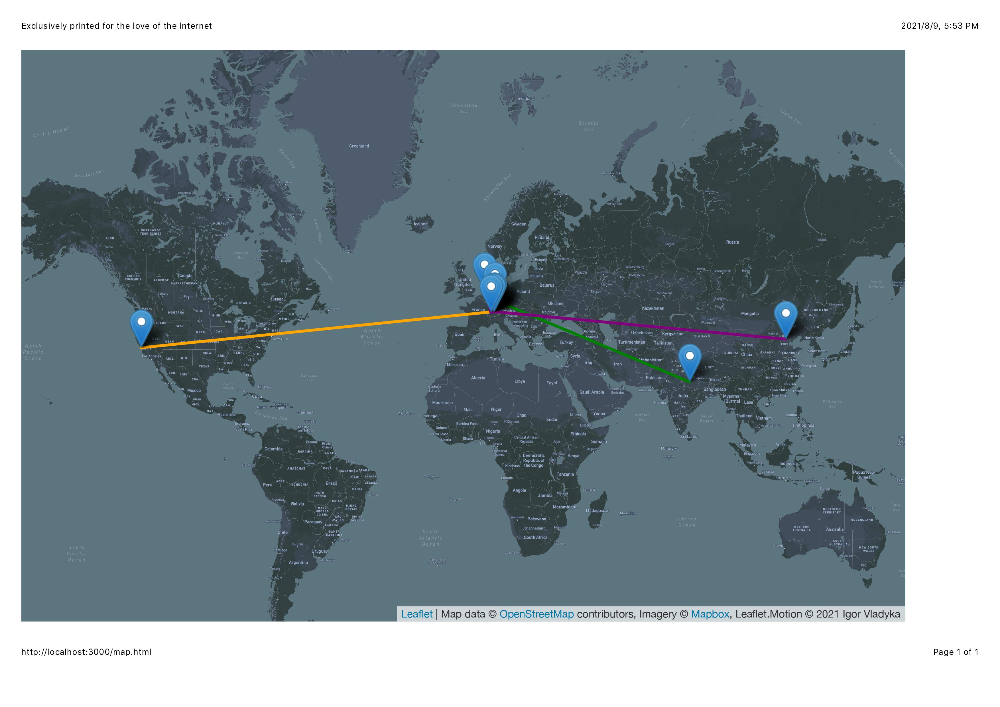

# World-wide-web-Travel-Map
A project visualizing trace-route in nodejs using Geolocation API, symbolizing push-pin world maps (but for the internet ;D).It illustrates how every HTTP request can mean crossing country borders and interacting with dozens of companies who own and control portions of Internet infrastructure a webpage must use to get to your computer.



## Usage and Download
Install package dependencies (express, nedb, node-js traceroute and node-fetch)
```
git clone https://github.com/pranavb104/World-wide-web-Travel-Map
cd World-wide-web-Travel-Map
npm install
npm start
```
## Printing Instructions
After pressing the print button, you need to set it to Landscape mode to get the full view. You can also change the map type (to pink) in the tab on the top right corner and select/deselect web routes. 

## Accuracy
By all means this is a fun project and should not be used as a network diagnostic tool. In China due to the Great Firewall, traceroute does not work with clear transparecy, so it requires a use of VPN. Funny thing, a VPN on the other hand uses Bogon (hidden) IP's/computers in hidden locations. At the end, this tool helps to get an understanding of the inner working of the internet rather than a diagnostic tool.

